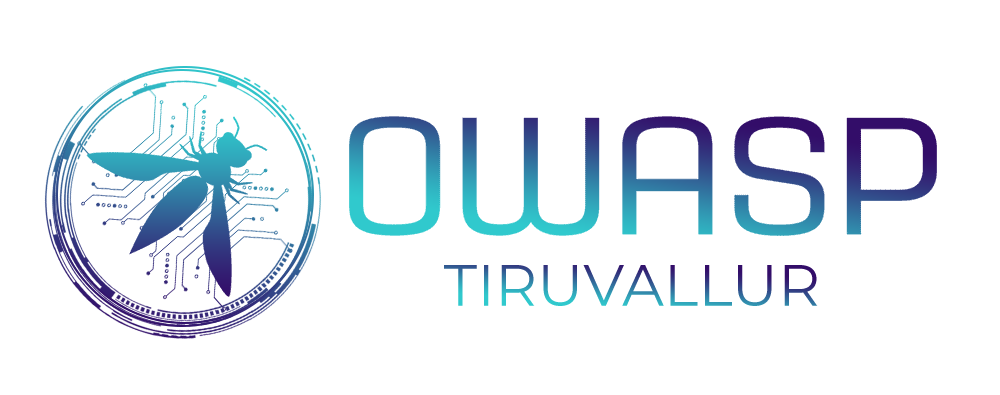

---

layout: col-sidebar
title: OWASP Tiruvallur
tags: Tiruvallur OWASP Chapter India
level: 4
region: Asia

---


## Welcome



OWASP Tiruvallur was founded in Aug, 2020. In the following days, our Tiruvallur Chapter has planned to conduct numerous Meetups, Webinars and Conferences. All these confereneces are open meets where everyone can join and share their knowledge in the Security domain. Our Chapter colloborates with the security community and contributes for Secure Application Development Projects and Network Strategies.

OWASP provides speakers to Institution of Engineers for Wednesday technical talks related to application security they organize. OWASP also provides speakers to Computer Society of India for technical sessions related to application security they organize.

## Participation

The Open Web Application Security Project (OWASP) is a nonprofit foundation that works to improve the security of software. All of our projects ,tools, documents, forums, and chapters are free and open to anyone interested in improving application security. 

Chapters are led by local leaders in accordance with the [Chapter Leader Handbook](/www-policy/rules-of-procedure/chapter-handbook). Financial contributions should only be made online using the authorized online donation button. To be a SPEAKER at ANY OWASP Chapter in the world simply review the [speaker agreement](/www-policy/speaker-agreement) and then contact the local chapter leader with details of what OWASP Project, independent research, or related software security topic you would like to present.

Everyone is welcome and encouraged to participate in our [Projects](/projects), [Local Chapters](/chapters), [Events](/events), [Online Groups](https://groups.google.com/a/owasp.com/){:target='_blank'}, and [Community Slack Channel](https://owasp.slack.com/){:target='_blank'}. We especially encourage diversity in all our initiatives. OWASP is a fantastic place to learn about application security, to network, and even to build your reputation as an expert. We also encourage you to be [become a member](/membership) or consider a [donation](/donate) to support our ongoing work.

## Speakers
Would you like to speak on the upcoming OWASP Coimbatore Webinar? [Contact Us](mailto:praveen.thiyagarayam@owasp.org)

**Email Format :**

- Speaker name
- Job Role
- Company / Organization
- Country
- Email ID
- Contact Number
- Speaker Profile
- Presentation Details
    - Name / Title of the Presentation
    - Abstract of the presentation
    - Presentation time required

## Local News
- Meeting Location
- Everyone is welcome to join us at our chapter meetings.

## Follow Us

<!-- Please don't remove this: Grab your social icons from https://github.com/carlsednaoui/gitsocial -->

<!-- display the social media buttons in your README -->

[![alt text][1]][1]
[![alt text][2]][2]
[![alt text][3]][3]

<!-- icons with padding -->

[1]: http://i.imgur.com/tXSoThF.png (twitter icon with padding)
[2]: http://i.imgur.com/P3YfQoD.png (facebook icon with padding)
[3]: http://i.imgur.com/0o48UoR.png (github icon with padding)

<!-- links to your social media accounts -->
<!-- update these accordingly -->

[1]: http://www.twitter.com/
[2]: http://www.facebook.com/
[3]: http://www.github.com/www-chapter-tiruvallur

<!-- Please don't remove this: Grab your social icons from https://github.com/carlsednaoui/gitsocial -->


<!--<div style='color:red;'>
This is an example of a Project or Chapter Page.  Please change these items to indicate the actual information you wish to present.  In addition to this information, the 'front-matter' above this text should be modified to reflect your actual information.  An explanation of each of the front-matter items is below:
layout: This is the layout used by project and chapter pages.  You should leave this value as col-sidebar
title: This is the title of your project or chapter page, usually the name.  For example, OWASP Zed Attack Proxy or OWASP Baltimore
tags: This is a space-delimited list of tags you associate with your project or chapter.  If you are using tabs, at least one of these tags should be unique in order to be used in the tabs files (an example tab is included in this repo) 
region: This is the region you are in according to our data
</div>-->


<!--Standard Chapter Page Template
This is an example of a Project or Chapter page.
Please change these items to indicate the actual information you wish to present. In addition to this information, the 'front-matter' above the text should be modified to reflect your actual information.  An explanation of each of the front-matter items is below:

{front matter for this file}

```
- layout: This is the layout used by project and chapter pages.  You should leave this value as col-sidebar
- title: This is the title of your project or chapter page, usually the name.  For example, OWASP Zed Attack Proxy or OWASP Baltimore
- tags: This is a space-delimited list of tags you associate with your project or chapter.  If you are using tabs, at least one of these tags should be unique in order to be used in the tabs files (an example tab is included in this repo) 
- region: This is the region you are in according to our data
```

{copy for this file (index.md)}
Replace the text above the commented area with your information in the format below:

```
## Welcome
Include some information here about your chapter

## Participation
The Open Web Application Security Project (OWASP) is a nonprofit foundation that works to improve the security of software. All of our projects ,tools, documents, forums, and chapters are free and open to anyone interested in improving application security. 

Chapters are led by local leaders in accordance with the [Chapter Leader Handbook](/www-policy/rules-of-procedure/chapter-handbook). Financial contributions should only be made online using the authorized online donation button. To be a SPEAKER at ANY OWASP Chapter in the world simply review the [speaker agreement](/www-policy/speaker-agreement) and then contact the local chapter leader with details of what OWASP Project, independent research, or related software security topic you would like to present.

Everyone is welcome and encouraged to participate in our [Projects](/projects), [Local Chapters](/chapters), [Events](/events), [Online Groups](https://groups.google.com/a/owasp.com/){:target='_blank'}, and [Community Slack Channel](https://owasp.slack.com/){:target='_blank'}. We especially encourage diversity in all our initiatives. OWASP is a fantastic place to learn about application security, to network, and even to build your reputation as an expert. We also encourage you to be [become a member](/membership) or consider a [donation](/donate) to support our ongoing work.

## Local News
- Meeting Location
- Everyone is welcome to join us at our chapter meetings.

{info.md}

This separate file is where you should place links to your Google Group and Meetup page. It will be automatically rendered in the column sidebar.

{leaders.md}

Another separate file that should simply include each leaders name with mailto link as a list. It will also be automatically rendered in the column sidebar.

```-->
