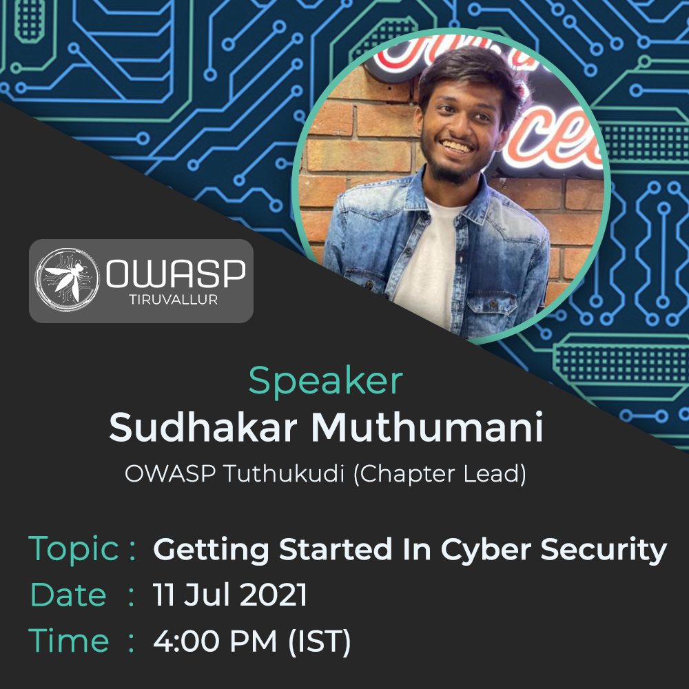
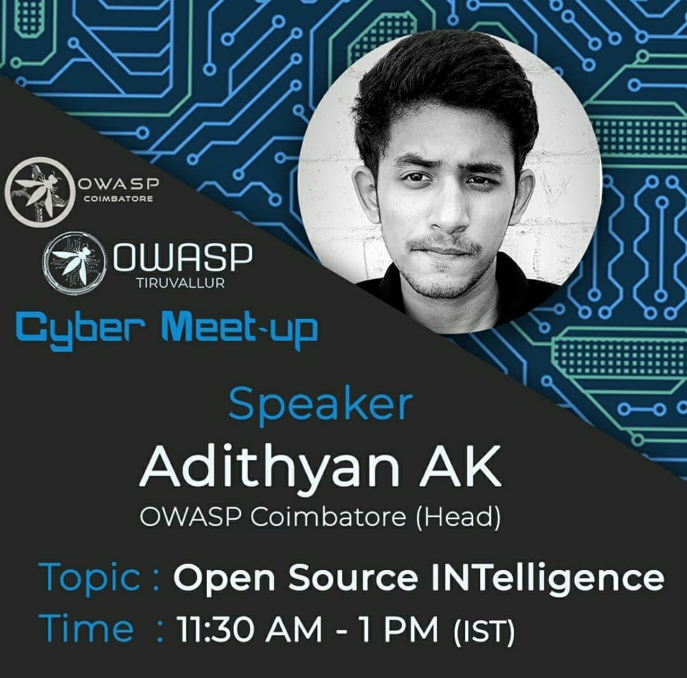

## Upcoming Events

## Past Events

### Landing In Your First InfoSec Job - Sunday, December 12 - 4:00 PM to 5:00 PM (IST)

### Getting Started in Cyber Security - Sunday, July 11 - 4:00 PM to 5:00 PM (IST)

### Open Source INTelligence - Sunday, September 27 - 11:30 AM to 1:00 PM (IST)

- [Session Recording](https://www.youtube.com/watch?v=jNU10hydtWY)

### RECONNAISSANCE (The Key To Ethical Hacking) - Sunday, September 27 - 10:00 AM to 11:15 AM (IST)

- [Session Recording](https://www.youtube.com/watch?v=vYAkRsUmiA0)

